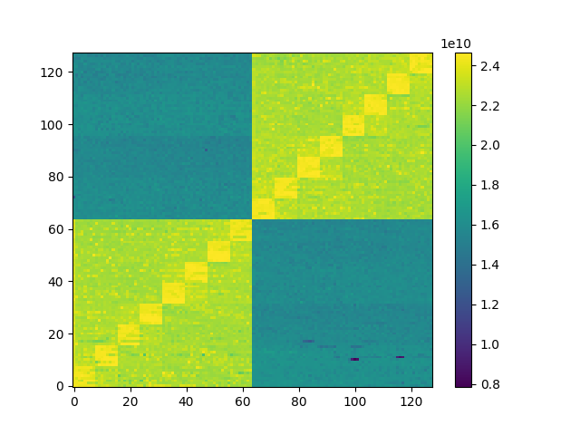

# Guidelines

## Installation

The program only depends on `hwloc` and locates it using `pkg-config`.

```sh
git clone https://github.com/besnardjb/memmapper.git
cd memmapper
# Makefile is trivial
make
```

## Usage

This project build several programs to measure multiple metrics:
* `memmapper`: core-to-core memory bandwitdh (memcpy's)
* `cache`: cache bandwidth
* `cache`: bound processes-to-processes memory transfer (`process_vm_*`)
* `shmem`: bound process-to-process memory transfer (MAP_SHARED)

To build all scenarios at once (each run will produce a JSON output file):
```sh
$ ./gen.py > s.sh
$ ./s.sh
```

memmapper Usage:
```sh
 : total size to move in bytes
 -i : number of averaging iterations
 -o : output json file
```

Other programs Usage:
```sh
Usage: ./<program> [-i/-I] [-c/-r] [-c]

Transfer: intra-socket (-i) or inter-socket (-I)
Prefetch: Cold (-c) or Hot (-r)
```

## Plot

Considering a file is generated with the `-o` option, it is possible to plot it using the embedded python script (requires `matplotlib`).

```sh
# If you do not have matplotlib (or are unsure)
pip install matplotlib
# Now the plot command (direct viz for a run with -o out.json)
./plot.py -i out.json
# It is also possible to generate output files directly
./plot.py -i out.json -o out.eps
```

To build results with matplotlib:
```sh
./plot.py -i out.json
# pretty-printing (in GB/sec)
./plot.py --gb -i out.json
# export depending on file extension
./plot -o file.png -i out.json

#one-liner
for f in ./results/*; do ./plot.py $f; done
```

### Sample Output



